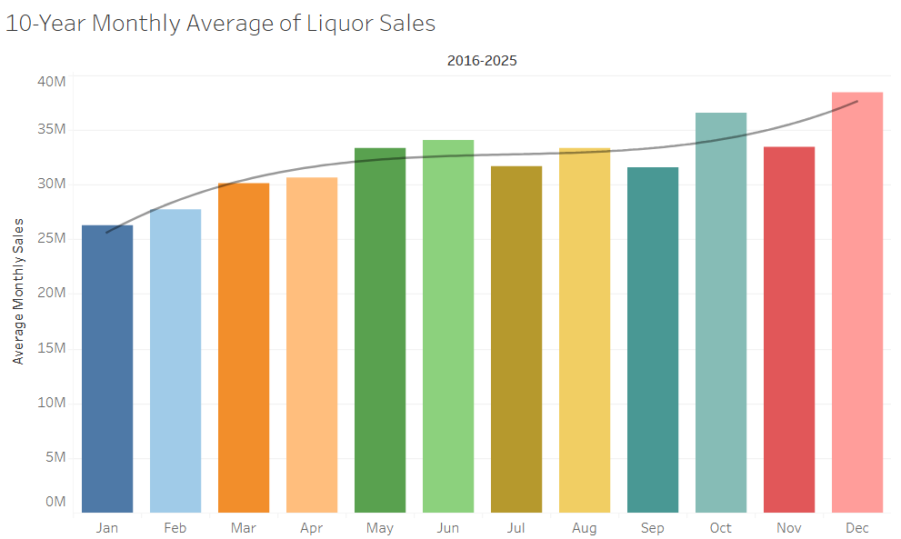

# Iowa Liquor Sales: 10-Year Monthly Trend Analysis

## 📌 Project Overview
This project analyzes millions of rows of liquor transactions in Iowa spanning from 2016 to 2025. The core objective is to move beyond simple, aggregate data traps and establish a highly accurate, normalized historical baseline for retail inventory forecasting. 

---

## 📊 Business Objectives & Questions
* **Operational Seasonality Baseline:** Which months experience predictable, recurring surges or drops in volume, and how does this dictate supply chain readiness?
* **Methodological Accuracy:** Why do absolute multi-year totals distort typical consumer buying habits, and how can SQL handle outlier biases?

---

## 🗄️ Dataset Used
* **Source:** Google BigQuery Public Data
* **Table:** `bigquery-public-data.iowa_liquor_sales.sales`
* **Scope:** Time-series filtering from **January 1, 2016, to December 31, 2025**.

---

## 💻 SQL Implementation: Multi-Layered Aggregation

To prevent individual outlier years (e.g., pandemic-era buying spikes) from skewing the results, this query uses a Common Table Expression (CTE) to calculate specific monthly totals first, before aggregating those results into a 10-year rolling monthly baseline.

```sql
WITH monthly_totals AS (
    SELECT 
        EXTRACT(YEAR FROM date) as sales_year,
        FORMAT_DATE('%b', date) as calendar_month, 
        EXTRACT(MONTH FROM date) as month_num,
        SUM(sale_dollars) as total_sales_in_that_specific_month
    FROM 
        `bigquery-public-data.iowa_liquor_sales.sales`
    WHERE 
        date BETWEEN '2016-01-01' AND '2025-12-31'
    GROUP BY 
        sales_year, 
        calendar_month, 
        month_num
)

SELECT 
    calendar_month,
    FORMAT("%'.2f", SUM(total_sales_in_that_specific_month)) as absolute_total_sales,
    FORMAT("%'.2f", AVG(total_sales_in_that_specific_month)) as average_monthly_sales
FROM 
    monthly_totals
GROUP BY 
    calendar_month, 
    month_num
ORDER BY 
    month_num ASC;

### 📋 Query Output (10-Year Aggregation Results)

| Calendar Month | Absolute Total Sales ($) | Average Monthly Sales ($) |
| :--- | :---: | :---: |
| **Jan** | 262,850,159.56 | 26,285,015.96 |
| **Feb** | 273,235,948.33 | 27,323,594.83 |
| **Mar** | 316,215,907.56 | 31,621,590.76 |
| **Apr** | 321,202,308.79 | 32,120,230.88 |
| **May** | 344,409,088.37 | 34,440,908.84 |
| **Jun** | 373,736,654.56 | 37,373,665.46 |
| **Jul** | 337,135,160.03 | 33,713,516.00 |
| **Aug** | 347,748,015.14 | 34,774,801.51 |
| **Sep** | 353,243,158.33 | 35,324,315.83 |
| **Oct** | 377,208,603.95 | 37,720,860.40 |
| **Nov** | 350,919,252.09 | 35,091,925.21 |
| **Dec** | 386,928,098.39 | 38,692,809.84 |

---

## 📈 Executive Insights & Tableau Visualization

Below is the visualized trend chart mapping out the historical baseline metrics over the 10-year span.



### Key Takeaways for Retail Stakeholders:
* **The Normalization Factor:** Utilizing absolute totals displays a deceptive ~$262M for January, which is non-actionable for a single fiscal year. The normalized average monthly sales isolates the true operational baseline closer to **$26.2M**.
* **The Q4 Operational Surge:** The visualization highlights a massive, steady revenue climb beginning in October ($37.7M) and peaking in December ($38.6M). Supply chain managers must secure peak inventory levels by mid-autumn to prevent major stockouts.
* **The Post-Holiday Crater:** Immediately following the December holiday peak, sales sharply plunge to an annual low of $26.2M in January. This represents the ideal strategic window for retail asset maintenance, floor restructuring, and inventory clearance sales.
